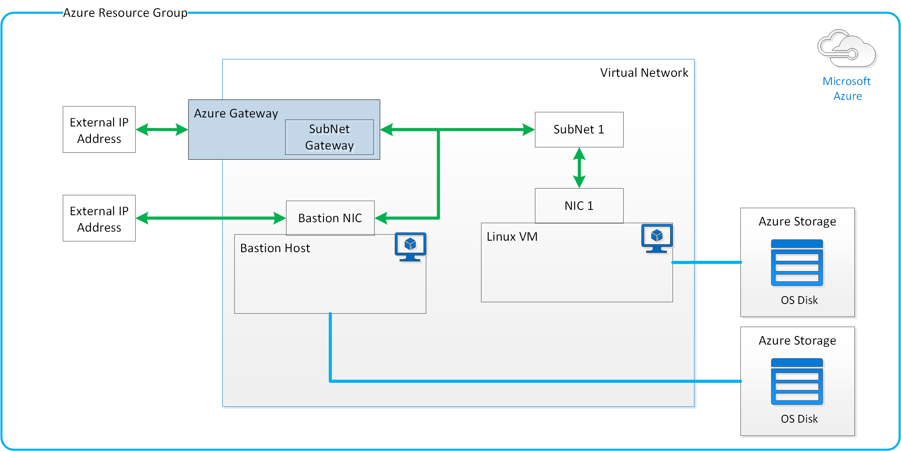

# Deployment of the Azure Gateway with a Linux VM and a Bastion Host

## Description

This template allows you to deploy an Azure Gateway, that routes traffic to a Linux VM running NGNIX. The Linux VM does not have a public IP address, since it gets its IP from the private subnet behind the Application Gateway. 

In order to access the private subnet, we have deployed a Bastion Host (Jumpbox) in the solution to use as an intermediary. The Bastion host is also used to execute remote scripts in a VM which does not have a public IP. The connection block in the "vm" resource demonstrates this functionality. The connection block shows the use of a Bastion host as an intermediary between the target "host" and the Terraform executor.

```hcl
    connection {
        type                = "ssh"
        bastion_host        = "${azurerm_public_ip.bastion_pip.fqdn}"
        bastion_user        = "${var.username}"
        bastion_private_key = "${file(var.private_key_path)}"
        host                = "${element(azurerm_network_interface.nic.*.private_ip_address, count.index)}"
        user                = "${var.username}"
        private_key         = "${file(var.private_key_path)}"
    }
```

**Note:** The Azure Application Gateway may take up to 17 minutes to be completely deployed and configured.

## Architecture of Deployed Solution

The following diagram shows the high level deployment architecture: 



## Instructions

### Setting up the SSH Certificates

In order to use this sample, we recommend creating SSH keys to secure both the Linux VM and the Bastion Host.  The SSH keys need to be located in the same machine where Terraform is executed. Run `ssh-keygen` to generate the keys and point the variables: `public_key_path` and `private_key_path` to the appropriate public and private key files.

### Running the Solution

```bash
$ terraform init && terraform apply
# Enter deployment variables in the prompt
```

### Connecting to the Machine

Create a file `~/.ssh/config` and paste the following config. Run the command `ssh vm1` from the Terraform executor machine to ssh into the private network machine. The machine must have the same private and public key pair used to create the machines.

```
Host bastion
  Hostname ${var.hostname}-bastion.${var.location}.cloudapp.azure.com
  User ubuntu
  PasswordAuthentication no
  PubkeyAuthentication yes

Host vm1
  Hostname 10.254.1.4
  User ubuntu
  PasswordAuthentication no
  PubkeyAuthentication yes
  ProxyCommand ssh ubuntu@bastion nc %h %p
```

## Terraform Files

### main.tf
The `main.tf` file contains the actual resources that will be deployed. It also contains the Azure Resource Group definition and any defined variables.

### variables.tf
The `variables.tf` file contains all of the input parameters that the user can specify when deploying this Terraform template.

Terraform requires the parameters `client_id`, `client_secret`, `subscription_id`, and `tenant_id` in order to deploy to Azure. The service account must be created in Azure Active Directory to generate the `client_id`, `client_secret`, and `tenant_id`. The `subscription_id` can be recovered from your Azure account details.

Please go [here](https://www.terraform.io/docs/providers/azurerm/) for full instructions on how to create this to populate your `provider` block.

| Variable      | Description    | Default |
| ------------- |--------------|---------|
| subscription_id | The subscription to create the deployment with. |  |
| client_id | The client ID of the service account (principal). |  |
| client_secret | The client secret of the service account (principal). |  |
| tenant_id | The ID of the Azure Active Directory Tenant. |  |
| resource_group | The name of the resource group in which to create the virtual network. |  |
| hostname | VM name referenced also in storage-related names. |  |
| dns_name |  Label for the Domain Name. Will be used to make up the FQDN. If a domain name label is specified, an A DNS record is created for the public IP in the Microsoft Azure DNS system. |  |
| location | The location/region where the virtual network is created. Changing this forces a new resource to be created. | southcentralus |
| virtual_network_name | The name for the virtual network. | vnet |
| vm_size | Specifies the size of the virtual machine. | Standard_A0 |
| image_publisher | name of the publisher of the image (az vm image list) | Canonical |
| image_offer | the name of the offer (az vm image list) | UbuntuServer |
| image_sku | image sku to apply (az vm image list) | 16.04-LTS |
| image_version | version of the image to apply (az vm image list) | latest |
| username | administrator user name | ubuntu |
| password | administrator password (recommended to disable password auth) | C0c0nut1234! |
| private_key_path | Path to the private ssh key used to connect to the machine within the gateway. | /home/ubuntu/.ssh/id_rsa |
| public_key_path | Path to your SSH Public Key | /home/ubuntu/.ssh/id_rsa.pub |

### outputs.tf
This data is outputted when `terraform apply` is called, and can be queried using the `terraform output` command.

### terraform.tfvars
If a `terraform.tfvars` or any `.auto.tfvars` files are present in the current directory, Terraform automatically loads them to populate variables. We don't recommend saving usernames and password to version control, but you can create a local secret variables file and use the `-var-file` flag or the `.auto.tfvars` extension to load it.
